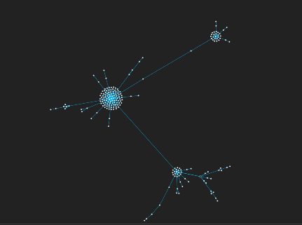
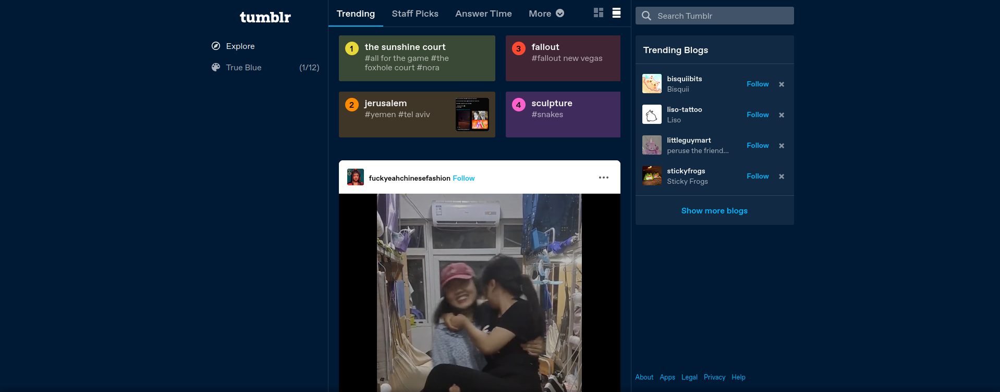
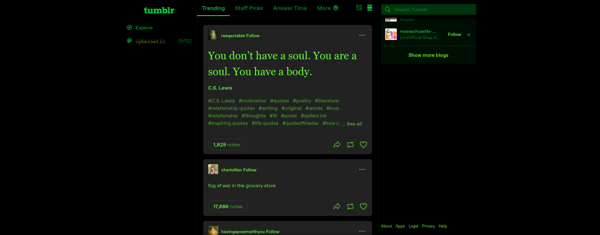
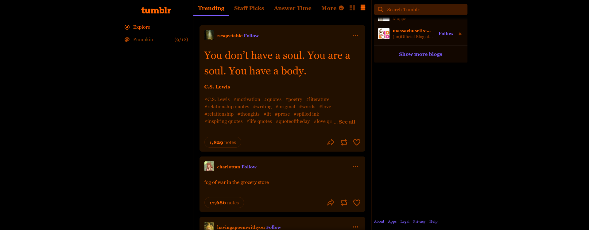
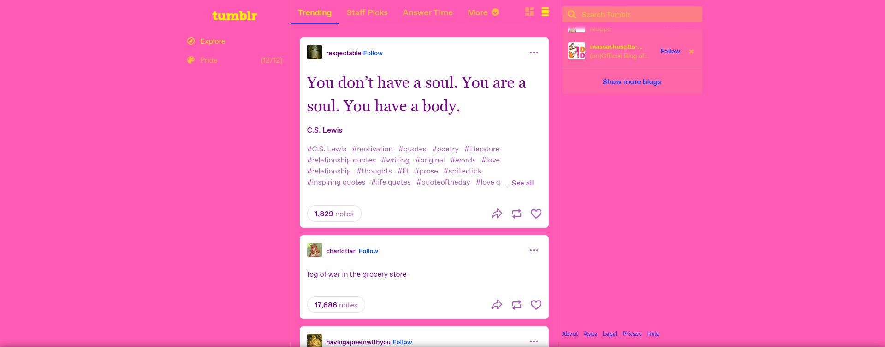
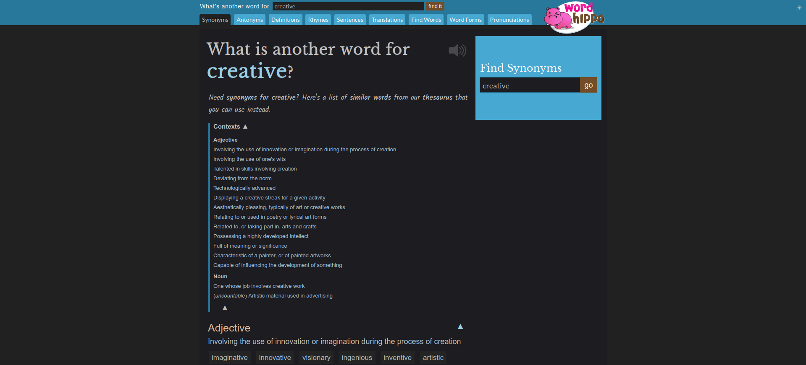
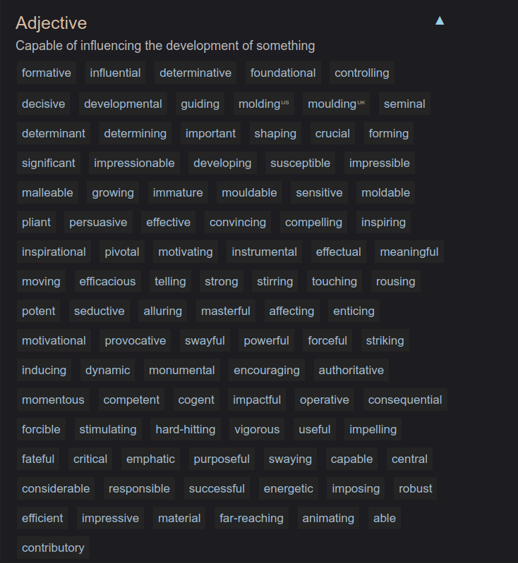

# Assignment 0

Five websites with five aspects each that I like or dislike about them.

### 1. Moodle

I use Moodle for all of my current classes; it's been a while since I've had to use something that wasn't Moodle.

#### Likes: 

1. **It functions.** It works. It provides accurate information. When your session is close to expiring, the appropriate popup appears, and when your session *has* expired, that popup updates to tell you you've been logged out.

2. **Predictability.** When I'm looking for certain information, Moodle's design is fairly consistent with where to find the given information (ie, seeking an instructor or fellow student's mail.linnbenton.edu address). Navigation within a course works as expected with the hierarchal sections 

#### Dislikes: 

1. **Notifications.** When I've taken classes with weekly forums, I tend to get spammed with emails alerting every post. This critique is half-baked as I'm not currently in a class where I could configure forum notifications, and I haven't spent a lot of time attempting to configure Moodle notifications in the past. However, I remember struggling with preferences, and I'm a little frustrated by getting email notifications before I get on-site notifications.

2. **Home page.** The home page doesn't really serve any purpose to me. It doesn't hold information relevant to me. It's a small complaint, but this doesn't make sense to me. Simiarly, I often find myself navigating to a page that lists *all* courses for the term -- not just courses I am a part of -- by complete accident: I feel this page should just be a little harder to stumble upon. 

3. **Usability for instructors?** (This dislike may be unfair.) I hear a lot of instructors complain about Moodle. From what I have seen, I have wondered how easy it is to use from the instructor's side.

### 2. Tumblr

I don't use a lot of social media, but I've been intermittently on Tumblr. There is a lot to discuss about any social media (moderation, content, userbase), but I will be focusing on the design of the webapp.

#### Likes:

1. **Post structure.** (To summarize a post's structure: any user may "reblog" a post, sharing it to their own blog/profile. When reblogging, a user has the option to make their own addition, as well as adding tags. When you reblog another user's reblog, you will share the original content and their addition, to which you may add your own addition and/or tags. This creates a chain of commentary.) I like how posts on Tumblr are generally structured:
    - They are easy to read and understand which user is saying what.
    - The structure encourages collaboration/discussion.
    - Tags are not a part of the post's body (as they are on Twitter and Instagram for instance). Instead, they are listed below.
    - Tags can also be used for both personal organization (organizing posts on your own blog -- only the original tags on a post will determine where you may discover the post in the global tagging system) *and* personal commentary. It is common for users to tag posts with anecdotes or rambles they don't want to share formally; while not an intended feature, I find it creates a unique and enjoyable experience.

2. **The reblog graph.** I was pleasantly surprised to see they added this feature since my teen years. I find it incredibly interesting to look at, as much as increasing the precision lags my browser.

    
    
    > An example of a single post's reblogs -- each white dot being a "reblog". This graph, the "reblog graph" is a visual generated by Tumblr.

3. **The "ask" and "submission" features.** I haven't seen equivalents on other social media sites. 

    The "ask" feature allows for users to send questions -- or statements, or of course harrassment -- to other blogs, with the option of anonymity. 

    The "submit" feature allows for users to submit original post content to other blogs.

    (Anonymous questions, the "askbox" as a whole, and submissions are things any user can enable or disable for their own blog -- good!)

    These features lend themselves to more creative uses for social media profiles than just personal use -- advice blogs is a common example. Anonymous questions allow for a stress-reduced way to ask for help or input, and submissions allow for additional collaboration in blogging.

#### Dislikes:

1. **Layout.** It's had a lot of layout redesigns over the years, and the current layout feels cluttered and poorly organized. The post feed is in the center of the screen, surrounded on the left and right by a column of navigation and a column of promotional or related content. Then surrounding this is just blank space. I feel the desktop layout does not efficiently utilize the space given.

    

2. **Color palettes.** The above screenshot shows the "default" look of Tumblr. It has a blue palette with white text, light-blue accent text. It is overall bearable, even if it sticks stubbornly to being monochromatic.

    Tumblr provides about 12 alternate color palettes. I think the majority of these are poorly designed, and fail to utilize more than two hues in an interesting or helpful way.

    
    
    In my opinion, the "cybernetic" theme is not good on the eyes. As much as I like the concept, it's unhelpful to just turn every .SVG and text node to neon green.

    

    In my opinion, the "pumpkin" theme is even worse: it puts bright orange text on brown backgrounds. Looking at this dashboard in this palette does not reveal any pattern of page components, except for links, which are purple. I appreciate a "spooky" or Halloween-inspired theme, but the purple links instead come across as distracting.

    

    I don't find this theme functional at all. It gets credit for using a whole three colors; however, bright yellow on a Pepto-Bismol pink background I can't take seriously. Similar to the pumpkin theme, the purple links also feel oddly out of place and distracting.

    > (Disclaimer: I am complaining about the worst themes of my personal opinion, there is maybe one that I like. I am also a bit photophobic and picky.)

### 3. WordHippo.com

WordHippo is a site that provides synonyms, antonyms, definitions, rhymes, translations, etc. I primarily use it for synonyms and antonyms, so I cannot speak to the accuracy of every feature.

#### Likes:

1. **Functionality and organization.** Given the nature of this site, its organization is key to its functionality. I will use a synonym page as an example:

    

    At the top is an expandable (currently expanded for the sake of example) list of contexts for the given word. This helps the user find more accurate synonyms (ie. a noun vs an adjective).

2. **Functionality and organization -- continued.** (I am making this two points because I am now discussing a different aspect of its organization and I want to keep this a little more succint.)

    

    I really like how words are listed. Each word links to its own page of synonyms. I also really like how simple the layout is without being a vertical-only list.

3. **Darkmode.** WordHippo has a little button in the upper-right corner that allows you to toggle a very simple dark-mode, as you may notice I have enabled. This does not interfere with the functionality of the site, and is something I always appreciate.

4. **Collapseable components.** As I've noted, a lot of these little components are collapseable/expandable. I appreciate that piece of configurability/customization, even if it is not beautiful.

#### Dislikes:

1. **Visual design.** WordHippo definitely puts functionality over beauty, which I do love. However, it's sort of ugly. Not to the point of causing any pain (I truly prefer this to overly-modernized pages), but it could use some help.

### 4. GitHub

I use GitHub to host my Git repositories. I also spend a fair amount of time browsing the code of projects I admire or use, both for reference and for pure curiosity.

This site has a lot of features, some of which I won't be acknowledging as I don't have much experience with them. Further, some features I *do* use will lack in-depth commentary as I don't quite use them enough to have an insightful perspective.

#### Likes:

1. **Home page.** I think its home page has a reasonable organization. When you're logged in, on the right-hand side is a list of your own repositories, in order of which has the most activity. I find this super convenient. In the middle of the homescreen is a feed of activity related to repositories and users you follow -- I never open GitHub to look at this, but I tend to find some enjoyment perusing this feed while bored.

2. **Switch accounts feature.** I don't have much to say about it, just that I think it's smooth and easy to use. I only have a personal and student account, and flipping between them is easy, I like and appreciate that GitHub considers that.

3. **Code browsing.** When browsing the code of repositories, I'm always focused on the code itself, and not distracted by how the site formats it. Not noticing the web design tends to be good web design. The code browser tends to supply accurate syntax highlighting.

4. **Navigation.** Navigation, both for the overall site and within a single code repository, is simple and I often find myself appreciating that simplicity. On the homepage activity feed, there is a filter feature at the top. There aren't a bunch of advertisements or attempts at capitalizing on its userbase.

#### Dislikes:

1. **Permission issues.** In collaborative repositories, I sometimes notice issues that are still marked as open, but have either been (A) fixed or (B) is not something that can be fixed directly but some conclusion has otherwise been reached. I do not have a lot of experience with this, but I find it interesting that the repository owner or someone else with authority in the project seems to not be able to mark the issue as closed.

    > Disclaimer: I'm not sure about this one, as it could be a handful of other things going on. But it is one of the few things that I think the site could have better organized.

### 5. 

#### Likes:

1.

#### Dislikes:

1. 

