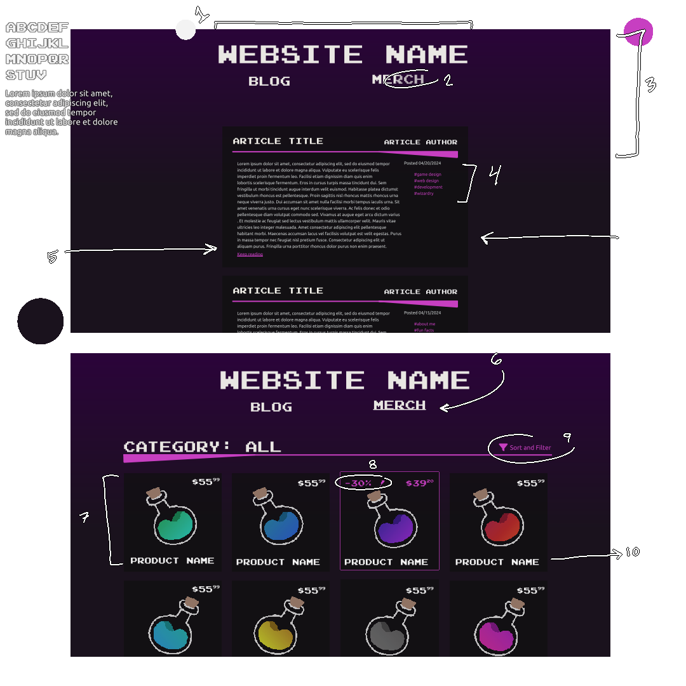

# CS290: Project 1 - 3

This readme documents my process in completing Projects 1 - 3.

**Contents:**
- [Requirements](#project-requirements)
- [Design](#project-design)
    - [Plan](#plan-meeting-requirements)
    - [Sketches](#design-sketches)

## Project Requirements

For this project, I am combining the requirements for Projects 1 - 3 (Weeks 1 - 4). Here is a table of those requirements, whether I met each requirement, and any notes on why I may have not utilized a certain element/attribute/property/design element.

| Project | Code piece                          | Language | Utilized? | Notes                                                   |
|--------:|:-----------------------------------:|:---------|:----------|:--------------------------------------------------------|
| **P1**  | `DOCTYPE`                           | HTML     | ✔️         |                                                         |
|         | `html`                              | HTML     | ✔️         |                                                         |
|         | `head`                              | HTML     | ✔️         |                                                         |
|         | `body`                              | HTML     | ✔️         |                                                         |
|         | `meta`                              | HTML     | ✔️         |                                                         |
|         | `lang`                              | HTML     | ✔️         |                                                         |
|         | `title`                             | HTML     | ✔️         |                                                         |
|         | headers (at least 3 from `h1`-`h6`) | HTML     |           |                                                         |
|         | paragraphs (`p`)                    | HTML     |           |                                                         |
|         | lists (`ol`, `ul`, `dl`)            | HTML     |           |                                                         |
|         | line breaks (`br`)                  | HTML     |           | I will be avoiding line breaks, as I prefer for CSS to control my page's line spacing. However, they may be utilized in blog posts, as realistically, a site admin would include a ` `. |
|         | anchor (`a`)                        | HTML     | ✔️         |                                                         |
|         | relative path                       | HTML     | ✔️         |                                                         |
|         | absolute path                       | HTML     |           |                                                         |
|         | fragment identifier                 | HTML     |           |                                                         |
|         | image                               | HTML     |           |                                                         |
|         | `video`                             | HTML     |           |                                                         |
|         | `width`                             | HTML     | ✔️         | Technically implemented in CSS.                         |
|         | `height`                            | HTML     | ✔️         | Technically implemented in CSS.                         |
|         | `alt`                               | HTML     |           |                                                         |
|         | `table`                             | HTML     |           |                                                         |
|         | row                                 | HTML     |           |                                                         |
|         | data cell                           | HTML     |           |                                                         |
|         | border                              | HTML     |           |                                                         |
|         | table caption                       | HTML     |           |                                                         |
|         | table header                        | HTML     |           |                                                         |
|         | table body                          | HTML     |           |                                                         |
|         | table footer                        | HTML     |           |                                                         |
|         | spanning columns                    | HTML     |           |                                                         |
| **P2**  | class attribute                     | HTML     | ✔️         |                                                         |
|         | class selector                      | CSS      |           |                                                         |
|         | id attribute                        | HTML     | ✔️         |                                                         |
|         | id selector                         | CSS      | ✔️         |                                                         |
|         | role attribute                      | HTML     |           |                                                         |
|         | attribute selectors                 | CSS      |           |                                                         |
|         | `font-family`                       | CSS      | ✔️         |                                                         |
|         | `font-size`                         | CSS      | ✔️         |                                                         |
|         | `font-style`                        | CSS      |           |                                                         |
|         | `font-variant`                      | CSS      |           |                                                         |
|         | `font-weight`                       | CSS      |           |                                                         |
|         | font property shorthand             | CSS      | ✔️         |                                                         |
|         | `text-align`                        | CSS      | ✔️         |                                                         |
|         | `text-decoration`                   | CSS      | ✔️         |                                                         |
|         | `line-height`                       | CSS      |           |                                                         |
|         | `color` (multiple methods)          | CSS      | ✔️         |                                                         |
|         | `border`                            | CSS      |           |                                                         |
|         | `padding`                           | CSS      | ✔️         |                                                         |
|         | `margin`                            | CSS      | ✔️         |                                                         |
| **P3**  | `background-color`                  | CSS      | ✔️         |                                                         |
|         | `background-image`                  | CSS      |           |                                                         |
|         | `overflow`                          | CSS      | ✔️         |                                                         |
|         | `box-sizing`                        | CSS      |           |                                                         |
|         | vendor prefix properties            | CSS      |           |                                                         |
|         | `float`                             | CSS      |           |                                                         |
|         | inheritance                         | CSS      |           |                                                         |
|         | clear                               | CSS      |           |                                                         |
|         | (clearfix and overflow)             | CSS      |           |                                                         |
|         | `position`                          | CSS      | ✔️         |                                                         |
|         | `z-index`                           | CSS      | ✔️         |                                                         |
|         | `display`                           | CSS      | ✔️         |                                                         |
|         | fixed-width layout                  | Design   |           |                                                         |
|         | fluid layout                        | Design   |           |                                                         |
|         | responsive layout                   | Design   |           |                                                         |
|         | `@media` query                      | CSS      |           |                                                         |
|         | `viewport`                          | HTML     | ✔️         |                                                         |
|         | navigation list                     | Design   |           |                                                         |
|         | breadcrumbs                         | Design   |           |                                                         |
|         | drop down menu                      | Design   |           |                                                         |
|         | sitemap                             | Design   |           |                                                         |
|         | search boxes                        | Design   |           |                                                         |

## Project Design

My concept for this assignment is a skeleton personal site, including a blog page and shop/"merch" page, as well as custom HTML pages.

Hypothetically, this site would be managed by the site owner through an `/admin` page, and viewed/patronized by users. However for the scope of this assignment, I will be focused on the interface and organization of various pages, as a blog and shop would each have their own server-side logic and databases, one much more complex than the other.

HTML pages I will write:
- Index page (`/`)

- Blog page (`/blog`)

- Shop page (`/merch`)
    - Product page (`/product/{id}`, or `/merch/product?id={id}`?)

- Admin page (`/admin`)
    * *As noted and implied by assignment scope, this page will not be functional. Additionally, it may not be terribly thorough.
    - Maybe I could do an admin login page (`/admin-login`)?

- Sitemap (`/sitemap`)
    * *This will be both a prototype of what the sitemap would look like within the hypothetical implementation of this site skeleton, and for the sake of easy navigation/access while developing/debugging/grading.

### Plan: Meeting Requirements

My plan for meeting requirements is as follows:

- I will use a `@media` query to give the site a functional mobile layout.
- The blog and shop pages will allow practice for responsive `flex` and `grid` layouts, respectively.
- Blog posts can utilize simple elements (headers, lists, `br`).
- Shop page will use a search bar, as well as breadcrumbs (ie: different products are sorted into different categories).
- I will use a `table` element for product details on the product page.
- The admin page will utilize inputs, as well as navigational dropdowns.

### Design Sketches

Before coding, I made some quick doodles to help think through the content, layout, and aesthetic of these pages.

Notes:

1. Big text (though usually larger than this) seems to be a bit of a modern trend. I kind of leaned into that, but moreso the simplicity of big blocky letters spelling out the name of the site.
    - Additional note: Clicking this header will link back to the index page.

2. The hover effect for the header links is that they'll lose a bit of transparency, just enough to be responsive to user interaction.

3. To add some texture and variation to the site background, I used this bit of a gradient reaching about one-third down the page. The gradient's color is the main pink accent, with blend mode set to "saturation".

4. For each article's preview card, it will have a small metadata column, with a posting date (and, if updated, a "last updated" date) and tags, or other information. 
    - The tags aren't set in stone, but I imagine a tag system is the best way to organize a personal blog for whatever subject.

5. Just a note: these sketches are not drawn very well to scale or centered. but the idea is that the article feed would be centered, would take up maybe about 50% of the total width? and be slightly narrower than the header.
    - Additionally, within the article, the preview paragraph and metadata would be slightly narrower than the article header.

6. Something I'll experiment with: putting an underline beneath whatever page the user is currently navigated to. It might be a nice, subtle location indicator, but I'm not sure if I prefer the underline.

7. Each product "card" would be a link to the given product's page.
    - On hover: I'm considering the background lightens.

8. For sales, I want to use pink to draw attention and make it look extra interesting. Though I'm not sure if this is best done with an "xx% off!" note, or crossing out the original price and writing the new price above it -- I've seen both and I'm not sure if one is more psychologically effective.
    - Note: I should also think about how to style an out-of-stock item.

9. For the sake of being simple on the eye, I want to keep all the sorting options in a sub-menu, and I want that menu to be easily accessible. Additionally, this sub-menu could have a fixed-width, I would just have to be careful about positioning for mobile.
    - Though come to think of it, I should add some sub-navigation at least for product categories, as that is the most common form of "filtering".

10. Each product will have its own page (following a template of course) with additional detailed information. I will design these after building the main pages, as the process of building this `/merch` page will teach me a lot about the design rules I want to uphold.

These mockups helped me get a sense of the general layout for the `/blog` and `/merch` page. 

    

    

    

I went with a very simple color scheme to begin with, as it is what came to mind. However, it is a bit limited and could use some work. The overall darkness of the pages make it feel a bit like a void, which isn't a feeling I'm personally opposed to, but I recognize it is not conventional.

