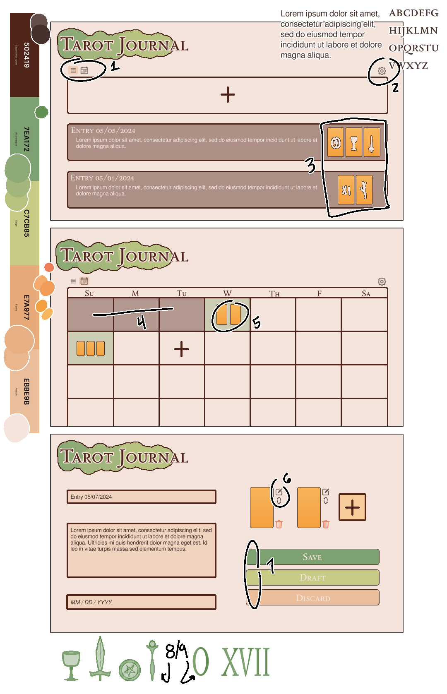

# Assignment 4

Javascript

Create a webpage with enough elements and styles that allow you to show off some JavaScript capabilities and include at least the following JavaScript features: input (perhaps using an input element), output (maybe inside a 
 or in a fancier element), variables of a few datatypes (at least number, string, boolean, and a couple objects), show off some common errors and how you might avoid them, conditionals, repetition, arrays, functions, demonstrate scope, objects and events

Requirements:
- [ ] Input
- [ ] Output
- [ ] Variables \[number, string, boolean, object]
- [ ] Errors and avoiding
- [ ] Conditions
- [ ] Repetition
- [ ] Arrays
- [ ] Functions
- [ ] Scope
- [ ] Events

### Concept

I plan to build a proof-of-concept for a single-page application daily journal for tarot card readings. This is something I would personally be interested in using because it could provide specific functionality specific to tarot cards that other journalling applications might not.

On the technical side, all data will be stored locally via `localStorage`. For the hypothetical future, there's potential for the role of an API for tarot card data (interpretations, card images, or related hobbies such as astrology).

