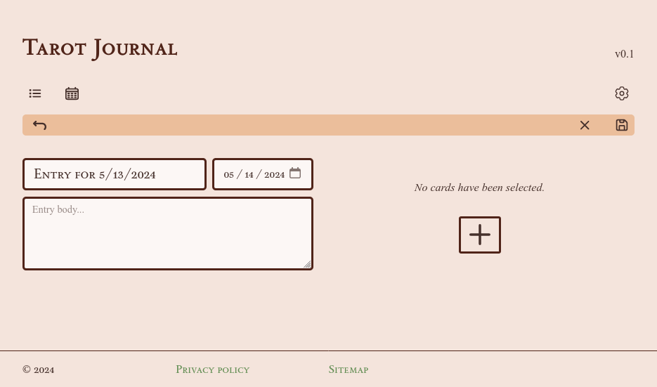
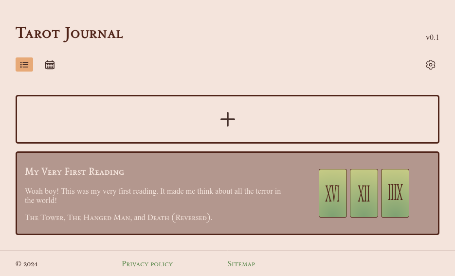
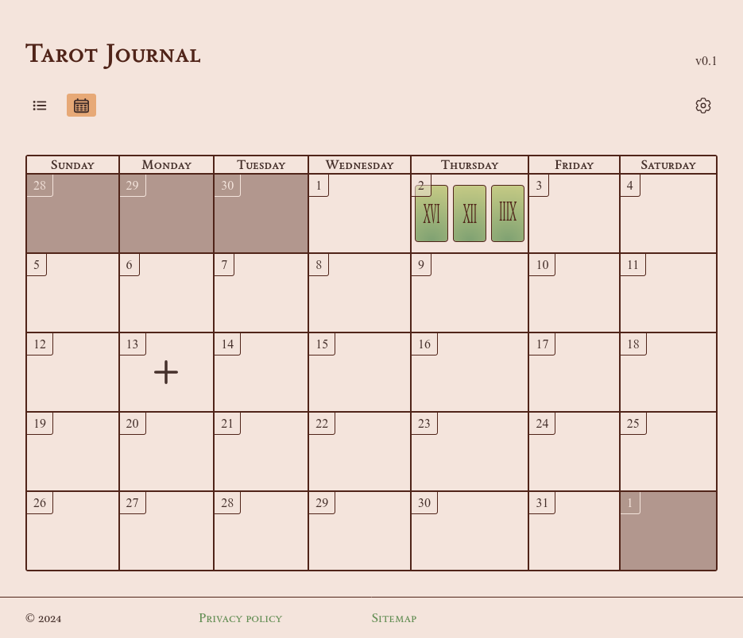

# Assignment 4

> This project was built with typescript. To set up, please run:
>   ```sh
>   mkdir ./assignment_4/site/static/js
>   npm install
>   npx tsc
>   ```
> The appropriate in/out directories should already be configured in `tsconfig.json` at the time of this commit.


- [Assignment requirements](#requirements)
- [Concept](#concept)
    - [Mockup](#mockup)
    - [Data design](#data-design)
    - [Content rendering](#content-rendering)
- [Testing](#testing)
    - [How to test](#how-to-test)
- [Outcome](#outcome)
- [Attributions](#attributions)


## Requirements

Taken from the assignment page: 

- [x] Input
- [x] Output
- [x] Variables (number, string, boolean, object)
- [x] Errors and avoiding
- [x] Conditions
- [x] Repetition
- [x] Arrays
- [x] Functions
- [x] Scope
- [x] Events


## Concept

I plan to build a proof-of-concept for a single-page application[1] daily journal for tarot card readings. This is something I would personally be interested in using because it could provide specific functionality specific to the mechanics and structure of tarot readings that other journalling applications lack.

On the technical side, all data will be stored locally via `localStorage`. For the hypothetical future, there's potential for the role of an API for tarot card data (interpretations, card images, or related hobbies such as astrology).

> ^[1] This project will not truly be one single page, as it is easier to navigate the user to a `/new-entry` page for input, as opposed to using JavaScript to populate the page with static information.


### Mockup


Notes:

1. I want to have two main layouts/views: a "log"-like view (shown in the first slide) that only shows previous entries, and a calendar view (in the second slide) that includes days without entries. 
    - The toggle between these two layouts will be treated like a navbar. Any other important pages will be added to this bar, sitting beside the settings button.

2. This settings button will open a settings menu with configurations for customization. There will be limited options in this proof-of-concept, possibly including:
    - Preferred default layout. This determines which layout is rendered when first opening the app.
    - Whether to show or hide entry text on the log page (for instance, replacing the "Lorem ipsum" with "(19 words)" to indicate content).
    - (Future:) Tarot deck "theme". As there are countless decks out there, each with their own unique art, it would be cool to let the user pick which art they want used in their journal.
    - (Future:) Calendar starting date. Sometimes I see calendar tools that allow configuration between starting on Sunday or Monday, so this would be nice to add to the Tarot Journal for polish.
    - (Future:) Page theme customization? I personally don't like light themes, and always search for the "dark theme" button. With personal/journalling applications, I think further personalization and customization of the color palette would be appropriate.

3. Each entry will have thumbnail previews of which cards were drawn. The content on these cards will be generated using CSS as follows:
    - Minor arcana (cards of the "cups", "swords", "wands", or "pentacles" suits) will have a `::before` element with an SVG of the corresponding suit.
    - Major arcana ("face cards" numbered 0 - 21) will display their corresponding Roman numeral, similarly through a `::before` element.
    - These classes will be assigned during the Javascript generation.

4. I feel comfortable tackling the calendar rendering as this is something I have done before, including the date-dependent rendering of content. Days that are not a part of the month will be darkened.
    - Note: I also forgot to include date numbering in this mockup, but that would be key to include.

5. Like the log view, each date with an entry on the calendar view would display thumbnails of the drawn cards. I will likely use `flex` to display these cards, and ensure that all cards (up to a reasonable limit) are shown in the box.
    - Note: Not pictured, but these cards would also have the `::before` elements mentioned in note #3.
    - Special case: If the user decides to make multiple entries for a single day, the first entry will be rendered to the calendar. I will be supporting multiple entries in one day as there is no reason not to.

6. When creating an entry in the journal and inputting which cards were drawn, there will be an "edit" button in case of a mistake, and a "reverse" button, to represent when a card was drawn "reversed".
    - The rest of the entry page is quite standard: two text inputs (one an `input` element and the other a `textarea` element) for entry title and entry body, and a date `input` element for the date of entry.

7. I'm not fully set on the layout of this page, especially when it comes to these buttons, but nonetheless this illustrates my plan to provide a few key features: a standard "save" button, a "discard"/cancel entrybutton, and possibly a "save to drafts" button.

8. I created some icons to represent the minor arcana suits in greater detail than on the log page. I may or may not use these.
    - Note: given the use of orange in the mockups, it may make more sense for these to be orange for coordination.

9. As the major arcana are only symbolized by Roman numerals, I do not need to worry about creating assets for these, I may just use the heading font and stretch it vertically for stylization.


### Data Design

This application will have a few key classes of data involved in the rendering of the log and calendar pages:

- Tarot card
- Journal entry
- Settings/Preferences

As noted, this data will all be kept in `localStorage` for the sake of privacy (and lack of responsibility for where to keep this data). Therefore, keep in mind it will be stringified to JSON.

To start simple, I plan to structure **journal entries** like this:

| **Property**        | **Type**      | **Required?**    | **Description**                                          |
|:--------------------|:-------------:|:----------------:|---------------------------------------------------------|
| `id`                | `number`      | ✔️                | It is always a good idea to give objects an id, this will make it easier to view/manipulate/delete the given entry.        |
| `title`             | `string`      | ✔️                | This will be the title of the entry. On the entry creation page, it will have a default value of "Entry for <date>". |
| `body`              | `string`      |                  | This is the user's comment on the cards. This is not required as maybe the user just wants to save what they drew in a day. (Without input, the value will be an empty string, not `null`).     |
| `date`              | `number`      | ✔️                | This is a representation of the date the card was drew. It is required because that is key to the functionality of the journal. I will store the date in milliseconds. Therefore, it will also include the time of entry (if automatically generated and not altered by the user -- for instance when making an entry for the previous day), however that will not be displayed.                                            |
| `cards`            | `object[]`    |                   | Cards drawn will be stored as an array of objects following the schema specified below. While this value cannot be `null`, it may be an array with 0 length.                        |

Structuring **tarot cards** becomes a little more complex, given how different minor and major arcana are, so they will be split into two separate classes both inheriting from a shared base class. That will look something like this:

| **Property**        | **Type**      | **Required?**    | **Description**                                          |
|:--------------------|:-------------:|:----------------:|---------------------------------------------------------|
| `reversed`          | `boolean`     | ✔️                | This simply indicates whether the card is reversed or not. Defaults to `false`.                                     |
| `arcana`            | `string`      | ✔️ (must be "MAJOR" or "MINOR") | This string will indicate whether the card is of major or minor arcana, this aids in the generation of the card from data (ie, which class to construct an instance of). |

With the major and minor arcana adding the following properties:

| **Arcana**  | **Property**        | **Type**      | **Required?**    | **Description**                                          |
|------|:--------------------|:-------------:|:----------------:|---------------------------------------------------------|
| _Minor_       | `rank`              | `number`      | ✔️  | The ranking of the card, 1 - 14 (Ace - Page, Knight, Queen King). |
|             | `suit`              | `string`      | ✔️ (must be "CUPS", "PENTACLES", "SWORDS", or "WANDS") | A string representing the suit. | 
| _Major_       | `numeral`           | `number`      | ✔️  | This number indicates the card's value 0 - 21. |

The base tarot card class will provide methods to generate card titles from these pieces of information.

> Note: It may be more space-efficient to find a way to encode cards as strings or numbers. EX: Non-reversed Major arcana "The Magician" may be stored as `"01 1"`, or reversed Minor arcana "Ten of Pentacles" may be stored as `"10 2A"`. (Where the first group is binary with a digit for "reversed" status and "major" status, and the second is hex with major/minor-specific information.) I will think about this.

**Settings and preferences** are a little more direct. As settings and preferences all have default values, only the altered values will be stored as individual flags with specific keys. (Or to rephrase: if there is no user preference found for the given property, it will default to a specific value.)

For the proof-of-concept, I aim to utilize these two properties:

| **Key name**       | **Type**      | **Default**      | **Description**                                         |
|--------------------|:-------------:|------------------|--------------------------------------------------------|
| `settings-default-layout` | `string` | `"LOG"`        | The first layout shown when opening the application, described by a string. |
| `settings-hide-entry-body` | `boolean` | `false`      | Whether or not to hide the body text of an entry in the log view.      |

I believe that covers data design.


### Content rendering

I plan to simply render entries to the page using JavaScript and the DOM. `HTMLElement` objects will be structured by being assigned children of one another, and the appropriate attributes (`class`, `id`, `href`, so on). 


---

## Testing

Primarily throughout this project, I did manual testing: I attempted to use the feature as intended, printed a lot of information to the console, and watched the resulting data and behavior carefully.


### How to test

1. Upon opening the site, you should be greeted with an empty index page, save for a big "+" button:

    

    Click this button to navigate to the `/new-entry.html` page.

    > Alternatively: travel to any page on the site from `/sitemap.html`.

2. From `/new-entry.html`, enter a memorable title and pay attention to the inputted date. Enter memorable body text, or none at all.

    

    > Note: As shown in the above screenshot, I've noticed the ocassional issue that the date input's date does not match the one received through `Date.toDateString()`. This is due to timezone management, though I'm not sure about a workaround when it comes to the date input.

3. To select which tarot cards you drew for a reading, click the "+" button under the text "*No cards have been selected.*" For the sake of testing, select whichever cards will be memorable.

    When selecting a card, it may not be immediately evident that it has been selected. Once you've clicked on the desired cards, clicking the "x" at the top of the popover, or clicking outside of the popover, will close the selection menu. Now you should see the selected cards above the "+" button.

    > Note: A typical tarot reading involves 1 - 3 cards, and I've found this interface is optimized for that range, but can handle more.

    Flip a card or two for the sake of testing by hitting the round arrow button.

4. When your entry is complete, hit the "save" icon in the upper-right corner, below the "settings" gear.

5. You should be taken back to the index log page, and greeted by your latest entry in full.

    

    Clicking the "calendar" icon, you should be taken to the calendar view page, which should show your entry in the expected date.

    

That is a walkthrough of the webapp's basic behavior, which should behave for the most part.


## Outcome

I was able to fulfill most of what I had planned, with some alterations as I worked on implementing the actual code.

My main struggles and features that I would want to expand on in the future are as follows:

- Single entry view page.

    I did not make a page to view a single entry. I am chosing not to do this because I wanted to reflect the fact that it did not occur to me until a couple days into this project, and I am a bit tired. Functionally speaking, you can still view the complete contents of any entry in the "log" view on the index page. However, a page to view a single entry is fairly basic, and I constantly found myself attempting to open a single journal entry.

- The calendar.
    
    Though it "works", there are a couple features I found myself missing once I built the calendar:
    - I would like to be able to click on any empty cell on the calendar and create an entry for that day.
    - I would, again, like to be able to click on any *full* cell on the calendar and view the page for that day's tarot entr(y/ies).
    - I would like to be able to page through previous months and interact with those entries.
    - I would also like to see what the current month is, and perhaps more information about the entry on hover, or in an info panel below the calendar perhaps.
    - I would like a good layout on mobile for the calendar. I have written a calendar before in a similar fashion and creating a mobile layout is what I got stuck on before.

- Settings and configurations.

    As I wrote this site, I had a handful of ideas for future settings that would manage the behavior of current and future features.

    Additionally the layout of this popover could be improved upon.

- Title card.

    I couldn't get the title of the page to have the cool green blob behind it as there was in the mockup, but I did not want to hyperfocus on one detail while I could be building the rest of the site.

Overall, I am happy with the outcome of this project. I think it is a solid start that I intend to build on.


## Attributions

I used a handful of SVG files all found on SVGRepo, some of which require attributions:

- [Calendar](https://www.svgrepo.com/svg/533389/calendar-days)
- [List](https://www.svgrepo.com/svg/489022/list)
- [Plus](https://www.svgrepo.com/svg/532997/plus-large)
- [Settings](https://www.svgrepo.com/svg/524954/settings)
- [Rotate](https://www.svgrepo.com/svg/510172/rotate-left)
