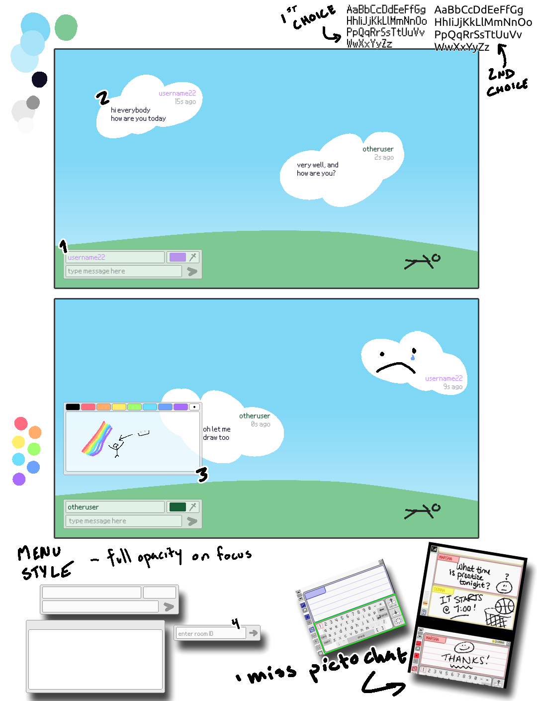

# Assignment 5

- [Concept](#concept)
    - [Drawing](#drawing)

## Concept

For this project, I want to get some experience with realtime interactions via websockets, and I've chosen [SocketIO](https://socket.io/) to use for socket management/framework/general guidance.

My initial concept for the site is a simple realtime messenger app. The gimmick is clouds drifting through a blue sky. The few menus there are can be dragged around and organized as desired by the user. When messages are sent, they appear as clouds for about 30 seconds before fading away.

Immediate concerns:
- May require a whole different layout on mobile.
- Definitely not a practical concept, nor would it be fun on a large scale or for serious use.
- Which animations should be JS and which should be CSS?

Despite concerns, I think it is a fun concept I know I and friends would play with, and more than that, I want to work with websockets. I will call this site "Cloudfaire", a play on "Cloudflare".

### Drawing

Some notes on my mockups:

1. The user will primarily interact with the site through this input box. There is a space for their username to go, a color to identify themself by, and an input box for the actual text they would like to send. The username and color is editable at any time, as I don't intend to deal with account creation for this project.

2. When sent, the message is broadcast to the room, and displays as a cloud. The cloud will fade in, drift, and fade out.
    - While I'll enforce a character limit, displaying text and image on little clouds might look goofy from time to time.

3. I want to create a small window for creating and sending a drawing with a limited size and color palette. I think that would be a fun challenge.

4. I think it would be a good challenge to implement a feature where multiple chat rooms can be created and used. This prototype would be the window via which a user joins a room -- a separate menu would create a room.
