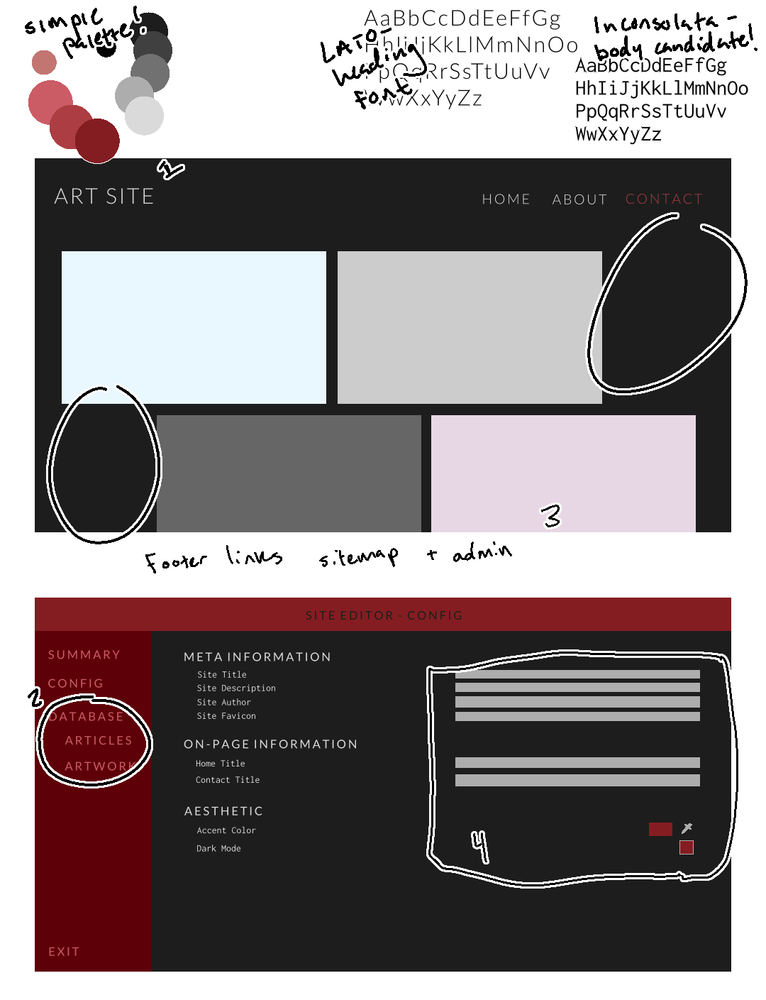

# CS290 Final Project

- [Design](#design)
    - [Base Concept](#base-concept)
    - [Mockup](#mockup-drawing)
    - [Data Design](#data-design)
        - [Meta Information](#meta-information)
        - [Page information](#page-information)
    - [Administration](#administration)
- [Scripts](#project-scripts-and-running-the-server)
    - [Setup](#setup)
    - [Build](#build)
    - [Running](#running)
- [Attributions](#attributions)


## Design

### Base Concept

This site is for a hypothetical independent visual artist looking to create a portfolio site.

Similar to my first project, I would like to make a site for hypothetical personal use. I want to make a simple client-side site that displays artwork, and provides an admin page (with a hopefully-secured password) to interact with the server and manage the site's artwork database.


### Mockup Drawing



As usual, some notes:

1. Aesthetically, I want to go for something spacey and minimalistic. I want to have empty space to let the page's contents breathe. In the first slide, there are two sections that I thought about populating with text, but I think might serve better as blank.

2. The main purpose of this site is to work with a database and build an web API to create secure interaction between the site's admin and the site's back-end. I only plan to build one table in the database that will keep track of art information -- however in this mockup, I include an "articles" table to emphasize the organization rules I would want to keep.

3. Back on the first slide: these rectangles are placeholders for art pieces, populated by the database introduced in the last point.
    - I hope to create a template page for viewing a single piece of art as well.

4. Input bars are not evenly drawn in the mockup, but I am thinking a very simple and straightforward form for editing information.
    - "Meta Information" is information that would show up in link previews, or the page's `<title>` elements.
    - "On-Page Information" is information that shows up on pages. The only listed properties are "Home Title" and "Contact Title". 
        > Normally, I think it would be much better to organize each page and its information into its own category. However, before I create a website that can render completely customized pages, I would like to write a page that can render template pages with customized information.
        > 
        > Nevermind, I will be going with more ideal option. See [page information](#page-information).
    - "Aesthetic" is a category I may not implement: I worry about the accessibility of a customizable color accent. This is an easy distraction pitfall for me, however visual customization is something I want to keep in mind for this type of site.


### Data Design

> I use a local SQLite database, located at `final_project/site/dev.db`. `package.json` will provide appropriate commands to create & reset this database.

The main focus of the site is displaying art pieces. The database table storing their data will be as follows:

| Property name        | Data type          | Default value     | Description                           |
|----------------------|:------------------:|:-----------------:|---------------------------------------|
| Id                   | `number`           | (Auto-increments) | An ID for the piece. (Internal use only.) |
| Name                 | `string`           | (Required)        | A name for the piece.                 |
| File name            | `string`           | (Required)        | File name for the associated image.   |
| Date                 | `string`           | Current day       | The date the piece was completed. Stored as "MM/DD/YYYY", and will be adjusted client-side for local time. |
| Description          | `string` or `null` | `null`            | A descriptive paragraph for the piece. |
| Collection name      | `string` or `null` | `null`            | The name of the collection the piece belongs to. |
| Medium               | `string`           | `""`              | Descriptor for the piece's medium.    |
| Additional credit    | `string`           | `""`              | A note of additional credit, if desired. |

These fields will be used to display a complete page of information on a single piece, as well as organization (ie: the 'collection name' property).

For the management of general site information (title, description, favicon), there will be two additional tables:


#### Meta information
A table that has one row with id `1`. Holds the following self-explanatory properties:
- Title
- Description
- Author

These values are used to populate `<meta>` tags in the `<head>` of each page.


#### Page information
 A table with a row for each page's information. This table will hold information for both "canonical" and non-canonical pages. 

- A "canonical" page is a built-in page that is included in the header and footer of the website. It cannot be removed, *and* it has a specific template.
- A "non-canonical" page is a page with custom content. Non-canonical pages are those that the admin creates on the site.


An example `PageInfo` table:

| Path            | IsCanonical    | Title                 | BodyText                                   | Hidden       |
|-----------------|:--------------:|----------------------------|--------------------------------------------|:------------:|
| `'index'`       | `TRUE`         | `'Home'`                   | `'Welcome to my webpage! This is my homepage. [Here](/about) is a link to my about page.'` | `FALSE` |
| `'about'`       | `TRUE`         | `'About'`                  | `'Here are a few paragraphs about myself, my life, and my interests. Because this is an example table, I won't be using any newline characters, but we can make believe!'` | `FALSE` |
| `'contact'`     | `TRUE`         | `'Contact Me'`             | `'Please reach out with any comments or questions. Business inquiries welcome!'` | `FALSE` |
| `'sitemap'`     | `TRUE`         | `'Sitemap Me'`             | `'Here is a list of all pages on my site! Except for this page, because it is hidden! It would be silly to list the sitemap on the sitemap!'` | `TRUE` |
| `'favorite-links'`     | `FALSE`         | `'My Favorite Sites'`             | `'This is a nice little page that lists all my favorite sites: - github.com - youtube.com - website.com'` | `FALSE` |
| `'pet-pics'`     | `FALSE`         | `'My Pets'`             | `'Enjoy my awesome pets!  '` | `FALSE` |

In which:

- The `Path` column (with exception of `'index'`, which indicates the path `'/'`) specifies the page's URL path. This, obviously, has to be unique.
- `IsCanonical` indicates if it is builtin or not. This property cannot be touched by the admin, and instead is for internal reference of which pages may be removed.
- `Title` and `BodyText` are fairly self-explanatory and used for page content. `BodyText`, however, supports markdown.
- `Hidden` indicates if it should be hidden from appearing on the sitemap.


### Administration

For administration, I have created an incredibly simple (and insecure) system, mostly using ExpressJS's `express-session` library. [This article](https://www.geeksforgeeks.org/how-to-manage-sessions-and-cookies-in-express-js/) walked me through how to set up a session using this library.

The admin login credetials are: 

    username: admin
    password: admin

Just as hinted in the input placeholders. These values are not configurable, though I have been thinking about changing that.


## Project Scripts and Running the Server

> Important notes:
>   - Ensure that SQLite is installed! I should test this all on windows aughaughg
>   - Ensure that you are using the latest version of NodeJS (v22.2.0)


### Setup

To run initial setup, use:

```sh
npm run final:setup
```

This is the equivalent of:
```sh
npm install
npm upgrade
cat final_project/site/schema.sql | sqlite3 final_project/site/dev.db  # Runs the schema setup script to build the initial database.
```

To reset the database, run:

```sh
npm run final:reset-db
```

Which deletes the existing `dev.db` and creates a new one from the schema.


### Build

To build the server, use:

```sh
npm run final:build
```

This compile the project's Typescript for both the client and server side.

During runtime, you may compile *just* the clientside code with:

```sh
npm run final:build-client
```

### Running

After building, run with: 

```sh
npm run final:run
```

This command simply runs the compiled `server.js` with Node.

By default, the server will run on port 8080. This may be changed in [`config.ts`](./site/config/config.ts).


## Issues

- Running `server.js` from any directory other than `site/`, pages cannot be rendered.
- Issue in one of the JS libraries (MarkedJS) on Node v20.12.1 -- ensure latest version of Node to avoid.
- Updating a boolean value does not appear to work, going from either true to false or false to true.
    - This could easily be fixed using the information I've set in the `database/properties.ts` file! I just may not have time to do it.


## Attributions

- [Favicon](https://favicon.io/emoji-favicons/artist-palette)
